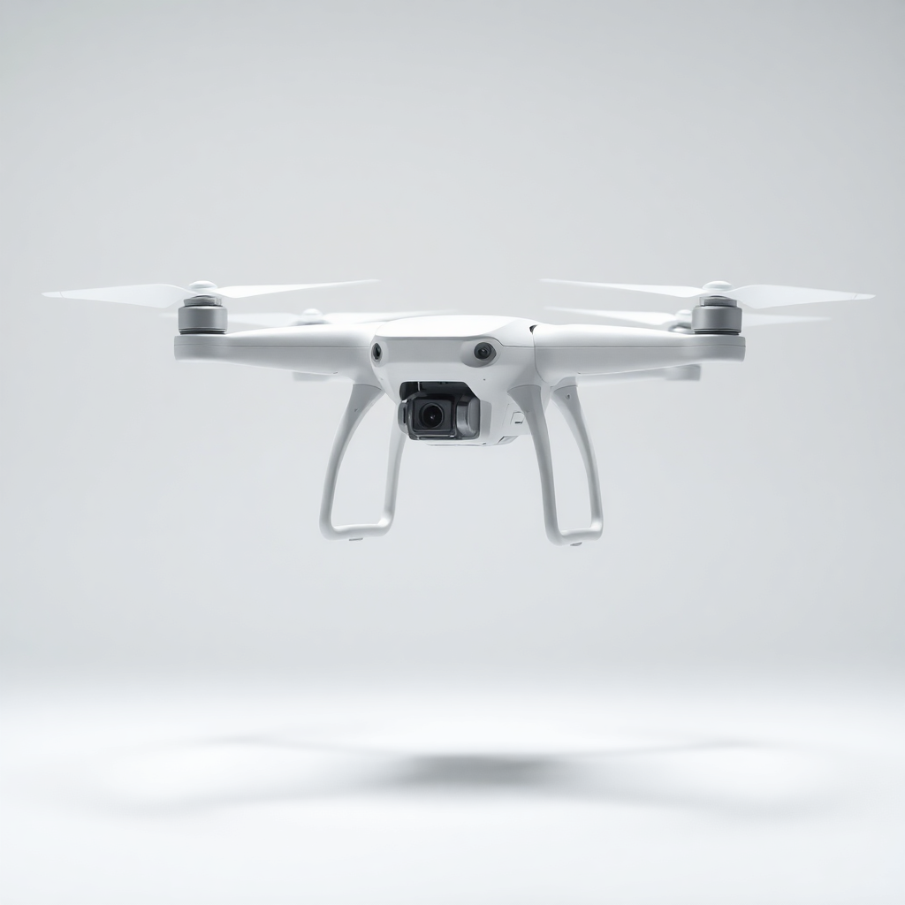

# 🚁 DJI Mavic 4 Pro — Product Landing Page

A fully responsive, professional **product landing page** for the DJI Mavic 4 Pro drone, built with pure **HTML, CSS, and JavaScript**. The project simulates a real-world e-commerce product page with a clean modern UI, competitive comparison table, customer reviews, and related products section.

---

## 🔗 Live Demo

👉 [https://yuossef-ashry.github.io/DJI-Mavic-4-Pro/](https://yuossef-ashry.github.io/DJI-Mavic-4-Pro/)

---

## 📸 Preview



---

## ✨ Features

- **Hero Section** — Eye-catching product showcase with pricing, discount badge, and CTA buttons (Add to Cart / Add to Wishlist)
- **Competitor Comparison Table** — Side-by-side feature comparison between DJI Mavic 4 Pro and 3 competitors (AirMaster Pro, FlightMax 4K, SkyHawk Elite)
- **Ratings & Reviews Section** — Aggregate rating display (4.9/5 based on 2,847 reviews), rating breakdown bars, and individual verified customer reviews
- **Related Products Section** — Accessory upsell cards (Pro Controller, Travel Case, Battery Kit, Safety Kit)
- **Responsive Navigation** — Smooth scroll navigation with anchor links (Home, Specifications, Ratings & Reviews, Related Products)
- **Footer** — Social media links, product/support/company link columns, and payment method icons (PayPal, Mastercard, Visa)
- **Fully Responsive** — Works on desktop, tablet, and mobile devices

---

## 🛠️ Tech Stack

| Technology | Usage |
|------------|-------|
| HTML5 | Page structure and semantic markup |
| CSS3 | Styling, layout (Flexbox/Grid), animations |
| JavaScript | Interactive elements and DOM manipulation |
| GitHub Pages | Hosting and deployment |

---

## 📁 Project Structure

```
DJI-Mavic-4-Pro/
│
├── index.html              # Main HTML file
├── css/
│   └── style.css           # Main stylesheet
├── js/
│   └── main.js             # JavaScript logic
└── img/
    ├── hero-img.png         # Main drone product image
    ├── avatar-1.png         # Customer review avatars
    ├── avatar-2.jpg
    ├── avatar-3.jpg
    ├── avatar-4.jpg
    ├── related-products-1.png  # Related product images
    ├── related-products-2.png
    ├── related-products-3.png
    ├── related-products-4.png
    ├── paypal.svg           # Payment icons
    ├── master-card.svg
    ├── visa.svg
    └── icons/               # UI icons (Font Awesome exported PNGs)
        ├── helicopter-solid-full.png
        ├── cart-shopping-solid-full.png
        ├── heart-solid-full.png
        ├── check-solid-full.png
        ├── yellow-star-solid-full.png
        ├── gray-star-solid-full.png
        ├── star-half-stroke-solid-full.png
        ├── trophy-solid-full.png
        └── ... (more icons)
```

---

## 🚀 Getting Started

### Run Locally

```bash
# 1. Clone the repository
git clone https://github.com/yuossef-ashry/DJI-Mavic-4-Pro.git

# 2. Navigate into the project folder
cd DJI-Mavic-4-Pro

# 3. Open in your browser
open index.html
# or simply double-click index.html
```

No build tools or dependencies required — it's pure frontend, just open and run!

---

## 📊 Product Specs Highlighted

| Spec | DJI Mavic 4 Pro |
|------|----------------|
| Video Resolution | 8K / 30fps |
| Photo Resolution | 48 MP |
| Flight Time | 40 minutes |
| Max Range | 10 km |
| Max Speed | 68 km/h |
| Obstacle Avoidance | 360° AI |
| Weight | 890g |
| Weather Resistance | IPX4 |
| Price | $2,499 |

---

## 🙌 Contributing

Pull requests are welcome! Feel free to open an issue for suggestions or bug reports.

---

## 📄 License

This project is for educational and portfolio purposes.  
DJI and Mavic are trademarks of SZ DJI Technology Co., Ltd.

---

## 👨‍💻 Author

**Yuossef Ashry**  
[](https://github.com/yuossef-ashry)
